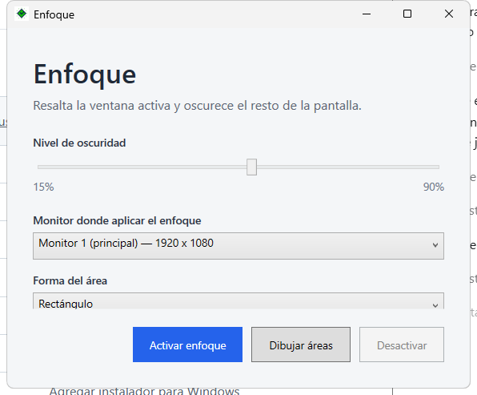

# Enfoque

Aplicación de escritorio para Windows que permite oscurecer un monitor y
mantener visibles una o varias áreas de interés.

## Funciones actuales

- Selección de monitor cuando hay más de una pantalla.
- Áreas rectangulares, cuadradas y circulares.
- Varias áreas de enfoque en el mismo monitor.
- Selección con pantalla oscura, área transparente y contorno punteado.
- Seguimiento del mouse con tamaño y forma configurables.
- Detección opcional de ventanas emergentes relacionadas.
- Panel lateral para editar áreas, cambiar la oscuridad, pausar y detener.
- Búsqueda manual de texto mediante el botón **Resaltar ahora**.

La búsqueda de texto se ejecuta únicamente al pulsar el botón. Usa Windows UI
Automation cuando la aplicación visible expone sus rangos de texto; algunas
páginas web o ventanas pueden no ofrecer esa información.

## Capturas y descarga




El instalador de Windows se encuentra en `artifacts/installer/Enfoque-Setup-1.2.3.exe`.

## Requisitos

- Windows 10 o superior.
- Visual Studio 2022 con la carga de trabajo **Desarrollo de escritorio .NET**.
- .NET 8 SDK.

## Ejecutar desde Visual Studio

1. Abrir `Enfoque/Enfoque.sln`.
2. Seleccionar `Enfoque` como proyecto de inicio.
3. Elegir `Debug` y `Any CPU`.
4. Presionar `F5`.

## Compilar desde PowerShell

Desde la carpeta raíz del repositorio:

```powershell
dotnet build .\Enfoque\Enfoque.csproj
```

El ejecutable se genera en:

```text
Enfoque\bin\Debug\net8.0-windows\Enfoque.exe
```

## Generar el instalador

El instalador usa Inno Setup y crea un acceso directo en el menú Inicio.
Para generar una versión:

```powershell
.\build-installer.ps1 -Version 1.0.0
```

El archivo se genera en `artifacts\installer`. Para una actualización futura
usa una versión superior, por ejemplo `1.0.1`; el mismo `AppId` hará que el
instalador actualice la instalación existente.

## Estructura principal

- `MainWindow`: ventana inicial y coordinación general.
- `SelectionWindow`: dibujo de áreas sobre el monitor.
- `OverlayWindow`: sombreado, seguimiento y resaltado.
- `ControlPanelWindow`: panel lateral de configuración.
- `RelatedWindowTracker`: detección de ventanas emergentes relacionadas.
- `FocusShape.cs`: formas y modelo de las áreas.

## Licencia

Este proyecto se distribuye bajo la licencia [MIT](LICENSE).
